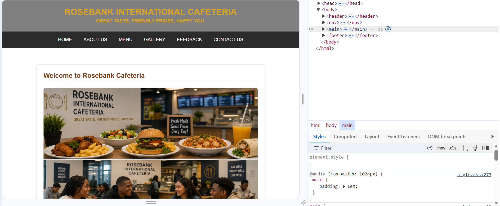
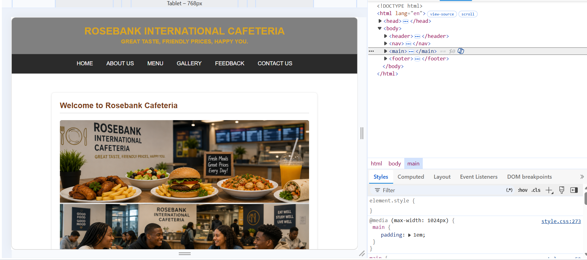
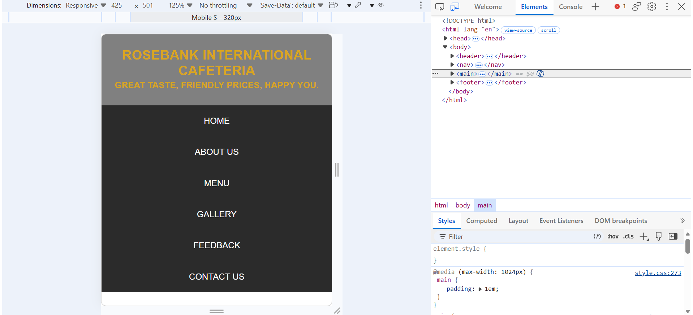

# Rosebank International Cafeteria 

## Project Context
A multi-page HTML website for Rosebank International Cafeteria which is a hypothetical cafeteria. Built by Nyeleti Pertunia Mukhawana for WEDE5020 (Web Development) PoE.

## Website Purpose
To make the cafeteria a well-organized, easily accessible dining service that reduces queuing time and confusion, and keeps students informed about what's on offer.

## Target Audience
Rosebank International Students,Lectures and other Academic Staff, Staff Members,Campus visitors

## Main Pages
Home - inde.html
About Us - about.html
Menu - menu.html
Gallery - gallery.html
Feedback - feedback.html
Contact Us - contact.html

## Technology used
HTML5, CSS, Git/GitHub, VS Code

## How to Run
Clone or download this repository.
Open the folder in VS Code.
Open index.html in a browser, or use the VS Code "Live Server" extension.

## Repository Structure
ri-pta-wede5020-part1-part2-part3-ST10512276
├── docs/
│   └── sitemap.png
├── index.html
├── about.html
├── menu.html
├── gallery.html
├── feedback.html
├── contact.html
├── images/
├── css/
│   └── style.css
├── README.md
└── CHANGELOG.md

Responsive Testing

## References
DataFlair, n.d. CSS Responsive Web Design Tutorial. [online] Available at: <https://data-flair.training/blogs/css-responsive-design/> [Accessed 18 September 2026].
Google, 2026. Google Maps. [online] Available at: <https://www.google.com/maps> [Accessed 15 September 2026].
Refine, n.d. Rem vs Em in CSS: What's the Difference? [online] Available at: <https://refine.dev/blog/rem-vs-em/> [Accessed 17 September 2026].
Usersnap Blog, 2026. Best feedback template 2026. [online] Available at: <https://usersnap.com/blog/feedback-form/amp/> [Accessed 12 August 2026].
W3Schools, n.d. CSS Tutorial. [online] Available at: <https://www.w3schools.com/css/> [Accessed 16 September 2026].
W3Schools, n.d. HTML-CSS. [video online] Available at: <https://www.w3schools.com/html/> [Accessed 13 August 2026].